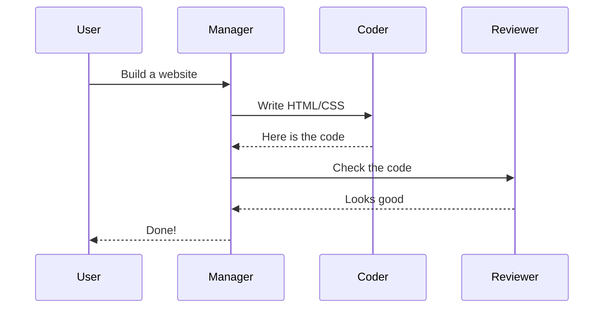

# Advanced Patterns

## Multi-Agent Systems

When multiple agents collaborate...

```mermaid
sequenceDiagram
    participant User
    participant Manager
    participant Coder
    participant Reviewer

    User->>Manager: Build a website
    Manager->>Coder: Write HTML/CSS
    Coder-->>Manager: Here is the code
    Manager->>Reviewer: Check the code
    Reviewer-->>Manager: Looks good
    Manager-->>User: Done!
```

### Configuration

Use `config.yaml` to define agent behaviors.
