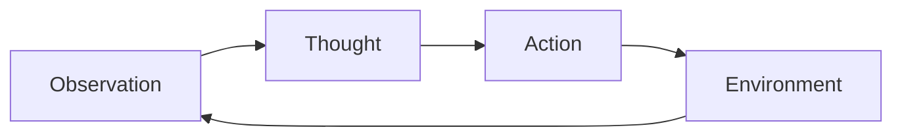

# Introduction to SmolAgents

Welcome to the **SmolAgents** tutorial. This module covers the basics of agentic AI.

## Agent Loop

The core of an agent is its loop:



## Features

- **Lightweight**: Minimal overhead.
- **Flexible**: Works with any LLM.
- **Tools**: Easy integration with Python functions.

Example code:

```python
from smolagents import CodeAgent, HfApiModel

agent = CodeAgent(tools=[], model=HfApiModel())
agent.run("What is the time?")
```
