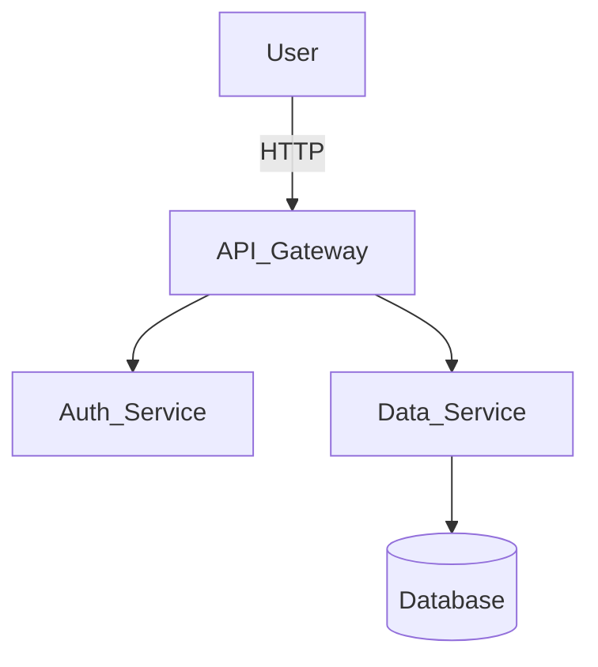

# Getting Started with Project Alpha

## Installation

```bash
pip install project-alpha
```

## Architecture

This project follows a microservices architecture.



## Quick Start

Initialize the client and make your first request.
