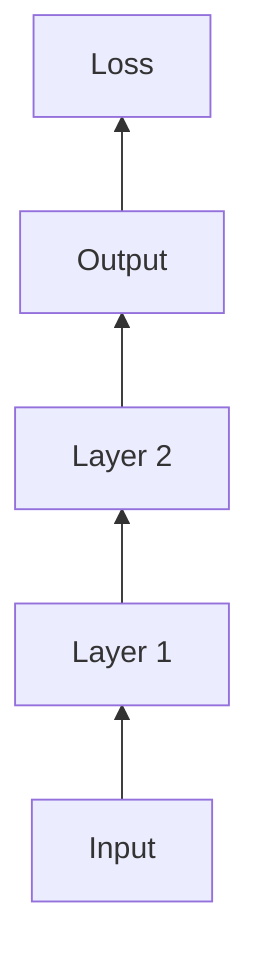

# DeepLearning Framework

A custom framework for deep learning experiments.

## Tensor Operations

We support basic tensor ops.

```python
x = Tensor([1, 2, 3])
y = x * 2
```

## Computation Graph


