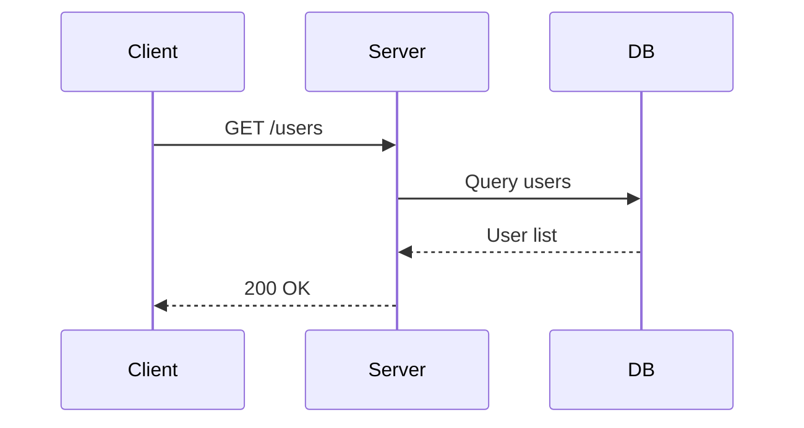

# API Reference

## Endpoints

### GET /users

Returns a list of users.

### Response

```json
{
  "users": [
    { "id": 1, "name": "Alice" }
  ]
}
```

## Flow


```mermaid
sequenceDiagram
    Client->>Server: GET /users
    Server->>DB: Query users
    DB-->>Server: User list
    Server-->>Client: 200 OK
```
