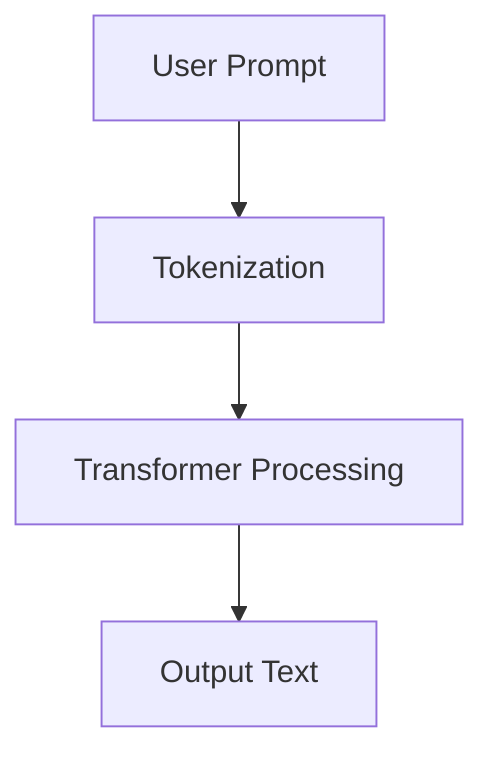

# Jules Prompt: Codebase Tutorial Generator UI

## Project Overview

I need you to build a **modern, AI-themed web UI** for an existing Python-based "Codebase Tutorial Generator" application. This application uses AI agents and LLMs to automatically generate comprehensive Markdown tutorials from codebases. **The tutorials already exist as static Markdown files** — the UI's job is to provide a beautiful, interactive way to browse and edit them.

### Important Context

- **This is a monorepo**: An existing Python project lives in the root. The UI must be placed in a `/ui` subdirectory to avoid conflicts.
- **No backend needed initially**: The UI will read static configuration (`content.yaml`) and Markdown files at build time / client-side.
- **Markdown files contain Mermaid.js diagrams**: The renderer MUST support Mermaid diagrams.
- **The UI interacts with static files only** — no Python/API integration required for this phase.

---

## Technology Stack

Build this project using:

- **Framework**: Next.js 14+ (App Router)
- **Styling**: Tailwind CSS 3.x
- **UI Components**: shadcn/ui (for consistent, modern components)
- **Markdown Rendering**: `react-markdown` with `remark-gfm` and `remark-mermaid` (or `mermaid` library direct integration)
- **Animations**: Framer Motion for smooth transitions and micro-animations
- **Icons**: Lucide React
- **State Management**: React Context or Zustand (lightweight)
- **Configuration**: Environment variables via `.env.local`

---

## Core Features & Requirements

### 1. Landing Page — Codebase Cards Grid

When the UI opens, display a **grid of interactive cards**, each representing a tutorial for a different codebase. Design inspiration: https://cot-visualizer.online/

**Card Requirements:**
- Each card displays:
  - Codebase name/title
  - Short description (1-2 sentences)
  - Icon or generated visual (can be a gradient placeholder or code icon)
  - Number of tutorial files/modules
  - Estimated reading time (optional)
- Cards must have:
  - Hover effects with subtle scale/lift animations
  - Smooth shadow transitions
  - Glassmorphism or modern card styling
  - Click ripple or glow effect on interaction
- Cards pull data from `content.yaml` configuration file

**Data Source (`content.yaml`):**
```yaml
codebases:
  - id: "smolagents-tutorial"
    name: "Smolagents Framework"
    description: "Learn AI agent development with Smolagents"
    icon: "robot"  # Lucide icon name
    color: "#8B5CF6"  # Accent color for card
    files:
      - path: "docs/mini-courses/1_llms.md"
        title: "Module 1: LLM Fundamentals"
      - path: "docs/mini-courses/2_rag.md"
        title: "Module 2: RAG Systems"
      - path: "docs/mini-courses/3_tools.md"
        title: "Module 3: Tool Integration"
      - path: "docs/mini-courses/4_agents.md"
        title: "Module 4: Agent Architecture"
      - path: "docs/mini-courses/5_multi_agent.md"
        title: "Module 5: Multi-Agent Systems"
  - id: "another-codebase"
    name: "Example Project"
    description: "Another tutorial example"
    icon: "code"
    color: "#06B6D4"
    files:
      - path: "path/to/file.md"
        title: "Getting Started"
```

### 2. Loading/Progress Animation Page

When a user clicks a card, show a **stunning loading animation page** before revealing the tutorial content.

**Requirements:**
- Full-screen overlay with semi-transparent dark backdrop
- Modern, animated progress indicator:
  - Circular progress ring with percentage
  - OR horizontal progress bar with glowing effect
  - Animated particles, waves, or AI-themed graphics (neural network nodes, data streams, etc.)
- Text animation showing "Processing codebase..." → "Analyzing structure..." → "Generating tutorial..." (cycle through messages)
- **Duration is configurable** via environment variable:
  ```env
  NEXT_PUBLIC_LOADING_DURATION_MS=3500
  ```
  Default: 3500ms (3.5 seconds)
- After progress completes, smoothly transition/reveal the tutorial page (fade, slide, or uncover animation)

**Visual Style:**
- Dark theme with accent color matching the selected card
- Glowing effects, gradient animations
- Think: AI/tech startup vibes, premium SaaS feel

### 3. Tutorial View Page

The main tutorial reading experience with a left sidebar and main content area.

#### 3.1 Left Sidebar — File Navigator

- **Position**: Fixed left panel, collapsible on mobile
- **Content**: List all Markdown files for the selected codebase
- **Features**:
  - Active file highlighted with accent color
  - Hover effects on file items
  - Smooth scrolling within sidebar if many files
  - File icons (document icon)
  - Optional: Group files by category/module if specified in config
  - Collapse/expand button for mobile responsiveness

#### 3.2 Main Content Area — Markdown Viewer/Editor

**Preview Mode (Default):**
- Beautifully rendered Markdown with:
  - Proper heading hierarchy with styled typography
  - Code blocks with syntax highlighting (use `react-syntax-highlighter` or `prism-react-renderer`)
  - **Mermaid.js diagram rendering** (CRITICAL — many tutorials contain flowcharts)
  - Styled blockquotes, lists, tables
  - Smooth scroll behavior
  - Zoom controls or pinch-to-zoom on diagrams
  - Responsive images
- Typography: Use Inter or similar modern font

**Edit Mode:**
- Toggle button in toolbar: "Preview" ↔ "Edit"
- In edit mode:
  - Show raw Markdown in a code editor component (Monaco Editor or CodeMirror preferred)
  - Split view option: Editor on left, live preview on right
  - Syntax highlighting for Markdown
  - Line numbers
  - Auto-save indicator (even if just to localStorage for demo)
- Save button (for demo, can save to localStorage or just show a toast notification)

**Toggle Behavior:**
- Smooth transition animation between modes
- Keyboard shortcut: `Ctrl/Cmd + E` to toggle edit mode
- State persistence during session

#### 3.3 Toolbar

Top toolbar above content area with:
- Back button → returns to card grid (with transition animation)
- Current file name/path breadcrumb
- Preview/Edit toggle button
- Zoom in/out buttons (for diagrams and content)
- Full-screen reading mode button (optional)
- Dark/Light theme toggle (optional but recommended)

### 4. Header & Footer

**Header (Global):**
- Fixed/sticky header
- Project logo/title: "Codebase Tutorial Generator"
- Animated gradient text or subtle glow effect on title
- Navigation links (if applicable)
- Theme toggle button (sun/moon icons)

**Footer (Global):**
- Developer credits with names and GitHub links:
  ```
  Built by [Developer Name 1](https://github.com/developer1) & [Developer Name 2](https://github.com/developer2)
  ```
- GitHub icon linking to project repository
- Subtle animation on hover for links
- Copyright text
- Version number (optional)

### 5. UI/UX Design Requirements

**Overall Aesthetic:**
- **Modern AI/Tech Theme**: Dark mode by default with option for light mode
- **Color Palette**: Deep purples, electric blues, cyan accents, dark grays (#0F172A, #1E293B, #8B5CF6, #06B6D4)
- **Glassmorphism**: Use blur effects, transparency, and subtle borders for cards and modals
- **Gradients**: Subtle animated gradient backgrounds or accent gradients
- **Typography**: Clean, modern sans-serif (Inter, Plus Jakarta Sans, or similar from Google Fonts)

**Animations & Transitions (Framer Motion):**
- Page transitions (fade, slide, scale)
- Staggered card animations on load
- Hover micro-interactions on all interactive elements
- Smooth sidebar toggle
- Loading spinner/progress animations
- Button press feedback (scale down slightly)

**Responsiveness:**
- Mobile-first approach
- Sidebar collapses to hamburger menu on mobile
- Cards stack vertically on small screens
- Touch-friendly tap targets
- Readable typography at all sizes

**Accessibility:**
- Proper ARIA labels
- Keyboard navigation support
- Focus indicators
- Sufficient color contrast

---

## Project Structure

```
/ui
├── .env.local.example          # Example environment variables
├── .env.local                  # Local env (gitignored)
├── next.config.js
├── tailwind.config.ts
├── tsconfig.json
├── package.json
├── postcss.config.js
├── content.yaml                # Codebase configuration
├── public/
│   └── ...
├── src/
│   ├── app/
│   │   ├── layout.tsx          # Root layout with header/footer
│   │   ├── page.tsx            # Landing page (card grid)
│   │   ├── tutorial/
│   │   │   └── [id]/
│   │   │       └── page.tsx    # Tutorial view page
│   │   └── globals.css
│   ├── components/
│   │   ├── ui/                 # shadcn components
│   │   ├── Header.tsx
│   │   ├── Footer.tsx
│   │   ├── CodebaseCard.tsx
│   │   ├── LoadingProgress.tsx
│   │   ├── FileSidebar.tsx
│   │   ├── MarkdownViewer.tsx
│   │   ├── MarkdownEditor.tsx
│   │   └── Toolbar.tsx
│   ├── lib/
│   │   ├── config.ts           # Load and parse content.yaml
│   │   ├── markdown.ts         # Markdown processing utilities
│   │   └── utils.ts            # General utilities
│   ├── hooks/
│   │   └── useLocalStorage.ts  # For persisting edit state
│   └── types/
│       └── index.ts            # TypeScript interfaces
├── GUIDE.md                    # Setup and usage guide
└── README.md                   # UI-specific readme
```

---

## Environment Variables

Create `.env.local.example` with:

```env
# Loading animation duration in milliseconds
NEXT_PUBLIC_LOADING_DURATION_MS=3500

# Base path for markdown files (relative to project root)
NEXT_PUBLIC_MARKDOWN_BASE_PATH="../"

# Developer information for footer
NEXT_PUBLIC_DEVELOPER_1_NAME="Amir Kiarafi"
NEXT_PUBLIC_DEVELOPER_1_GITHUB="https://github.com/amirkiarafiei"
NEXT_PUBLIC_DEVELOPER_2_NAME="Developer 2"
NEXT_PUBLIC_DEVELOPER_2_GITHUB="https://github.com/developer2"

# GitHub repository URL
NEXT_PUBLIC_REPO_URL="https://github.com/amirkiarafiei/codebase-tutorial-generator"
```

---

## Mermaid.js Integration (Critical)

The tutorials contain Mermaid diagrams in code blocks like:

```markdown

```

**Implementation Requirements:**
1. Detect code blocks with language `mermaid`
2. Render them as SVG diagrams using Mermaid.js
3. Apply dark theme to diagrams matching the UI theme
4. Allow zoom/pan on larger diagrams
5. Handle rendering errors gracefully (show fallback)

Recommended approach:
- Use `mermaid` npm package
- Initialize with dark theme configuration
- Render diagrams client-side after markdown parsing

---

## Deliverables Checklist

- [ ] Next.js 14 project with App Router in `/ui` directory
- [ ] Tailwind CSS + shadcn/ui configuration
- [ ] Landing page with animated card grid
- [ ] Loading/progress animation page (configurable duration)
- [ ] Tutorial view with left sidebar navigation
- [ ] Markdown rendering with Mermaid.js support
- [ ] Edit mode toggle with Monaco/CodeMirror editor
- [ ] Header and Footer components
- [ ] Responsive design (mobile-friendly)
- [ ] Dark/Light theme toggle
- [ ] Framer Motion animations throughout
- [ ] `content.yaml` configuration system
- [ ] Environment variables setup (`.env.local.example`)
- [ ] GUIDE.md with complete setup instructions
- [ ] Update root README.md to mention the UI

---

## GUIDE.md Content Requirements

Create a comprehensive guide covering:

1. **Prerequisites** (Node.js version, npm/yarn/pnpm)
2. **Installation Steps**
   ```bash
   cd ui
   npm install
   ```
3. **Configuration**
   - How to set up `.env.local`
   - How to configure `content.yaml` for new codebases
   - How to add new tutorial files
4. **Running the Development Server**
   ```bash
   npm run dev
   ```
5. **Building for Production**
   ```bash
   npm run build
   npm start
   ```
6. **Customization Guide**
   - Changing colors/theme
   - Adding developer credits
   - Modifying loading duration
7. **Troubleshooting Common Issues**

---

## README.md Update Requirements

Update the root `README.md` to:

1. **Preserve all existing content** — do NOT remove any Python project documentation
2. Add a new section titled `## Web UI` after the existing documentation:
   ```markdown
   ## Web UI
   
   A modern web interface is available for browsing and editing generated tutorials.
   
   ### Quick Start (UI)
   
   ```bash
   cd ui
   npm install
   npm run dev
   ```
   
   Open [http://localhost:3000](http://localhost:3000) to view the tutorial browser.
   
   See [ui/GUIDE.md](ui/GUIDE.md) for detailed setup instructions.
   ```

---

## Final Notes

- **Quality over speed**: Take time to implement smooth animations and polished UI
- **Test Mermaid rendering**: This is critical — ensure diagrams render correctly
- **Mobile responsiveness**: Test on various screen sizes
- **Code organization**: Keep components modular and reusable
- **TypeScript**: Use strict typing throughout
- **Comments**: Add helpful comments for complex logic

The goal is a **portfolio-worthy, production-quality UI** that makes the tutorial browsing experience delightful. Think: Next.js documentation site meets Linear.app design aesthetic.